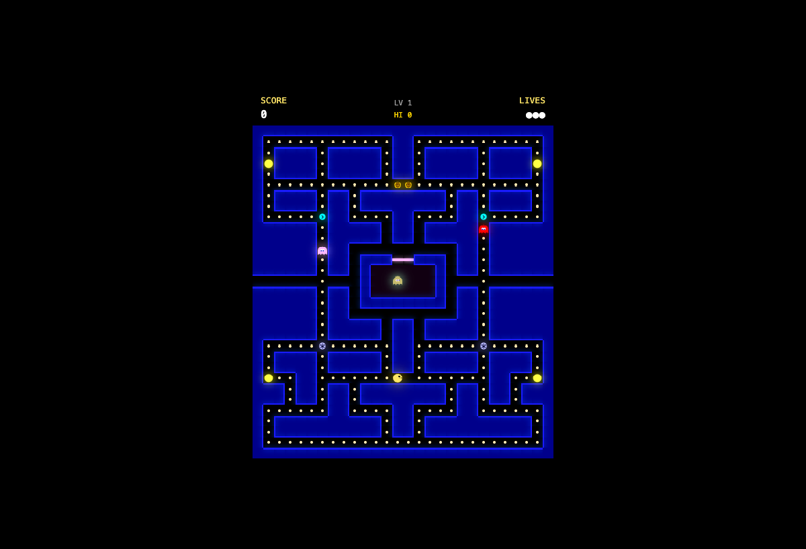
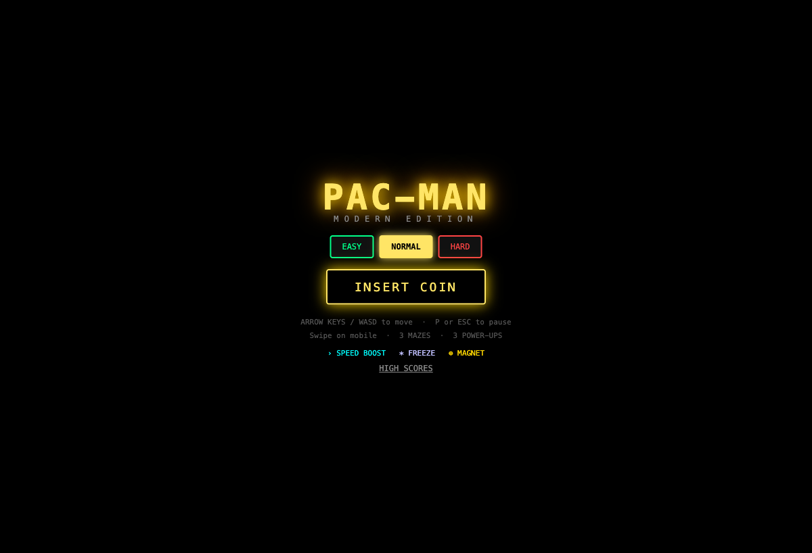

# Pac-Man

A modern browser-based Pac-Man clone built with React, TypeScript, and the Web Audio API. Runs at 60fps with canvas rendering, synthesized audio (no audio files), and three unique maze layouts.





## Features

- Classic Pac-Man gameplay with faithful ghost AI (Blinky, Pinky, Inky, Clyde)
- Three maze layouts that cycle as levels progress
- Three modern power-ups beyond the classic energizer:
  - **Speed** (cyan) — 2× Pac-Man speed for 5 seconds
  - **Freeze** (silver) — ghosts stop moving for 3 seconds
  - **Magnet** (gold) — pulls nearby ghosts and auto-eats on contact for 4 seconds
- Synthesized audio via Web Audio API — no audio asset files
- Particle effects on dot/ghost/power-up interactions
- Leaderboard with high score tracking

## Tech Stack

- **React 18** — UI overlays and menus only (not the game loop)
- **TypeScript** (strict mode)
- **Zustand** — low-frequency game state (score, lives, phase)
- **Canvas 2D** — all game rendering at 60fps
- **Vite 5** + **Bun**

## Getting Started

```bash
bun install
bun run dev       # http://localhost:5173
```

Other commands:

```bash
bun run build     # type-check + production build
bun run preview   # preview production build
bunx tsc --noEmit # type-check only
```

## Controls

| Key | Action |
|-----|--------|
| Arrow keys / WASD | Move Pac-Man |
| P / Escape | Pause |
| Enter | Start / confirm |

## Architecture

The game uses a strict boundary between the game engine and React:

- **`gameRef`** — a plain mutable JS object (`pacman`, `ghosts`, `particles`, `tileState`, etc.) mutated every frame by the RAF loop. React never sees this object.
- **Zustand store** — holds only low-frequency state: `phase`, `score`, `lives`, `level`, `leaderboard`. Updated only on meaningful events (dot eaten, death, level complete).
- **Canvas** — sized to 448×496px (28×31 tiles at 16px each). Never touched by React.

### Ghost AI

Ghost movement is tile-crossing based. Each ghost moves freely until crossing into a new tile, at which point it snaps to the tile center and picks the next direction using minimum Manhattan distance to its target (no 180° reversals). Each ghost has a classic targeting strategy:

- **Blinky** — directly chases Pac-Man
- **Pinky** — targets 4 tiles ahead of Pac-Man
- **Inky** — Blinky-relative double vector
- **Clyde** — chases when far, scatters when close

### Maze Format

Mazes are flat `TileType[]` arrays (28 cols × 31 rows, row-major). A separate `Uint8Array tileState` (same length) tracks which eatables remain (1 = present, 0 = eaten). The layout array never mutates during play.

## Project Structure

```
src/
├── types/           # game.ts, entities.ts, maze.ts
├── constants/       # game.ts, ghosts.ts, difficulty.ts
├── mazes/           # maze1 (Classic), maze2 (Open Arena), maze3 (Labyrinth)
├── store/           # gameStore.ts (Zustand)
├── engine/
│   ├── ai/          # blinky/pinky/inky/clyde + dispatcher
│   ├── gameLoop.ts  # master RAF loop
│   ├── collision.ts # tile helpers, tileToPixel, manhattanDistance
│   ├── movement.ts  # Pac-Man movement
│   ├── modeTimer.ts # chase/scatter/frightened cycle
│   ├── powerups.ts  # 3 modern power-ups
│   └── scoring.ts   # points, combos
├── rendering/       # drawMaze, drawPacman, drawGhosts, drawPellets, drawParticles
├── particles/       # pool (512 slots), effects presets
├── audio/           # audioContext, synthesizer, sounds facade
├── hooks/           # useGameCanvas, useInputHandler, useGameLoop
└── components/      # GameCanvas, HUD, screens (Menu/Pause/LevelComplete/GameOver)
```
